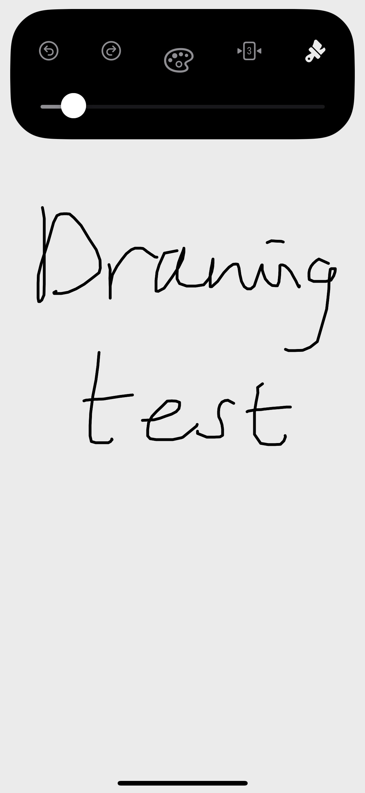
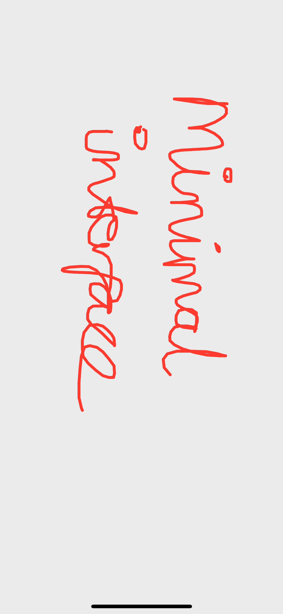
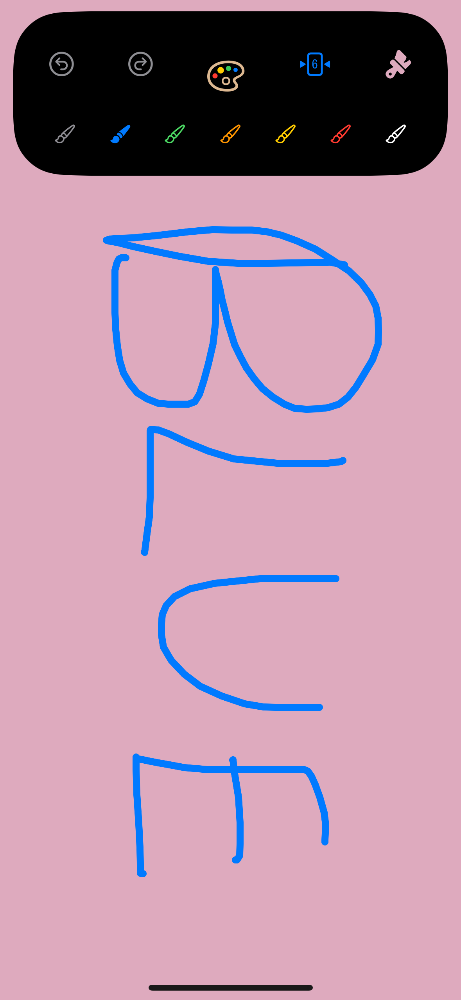
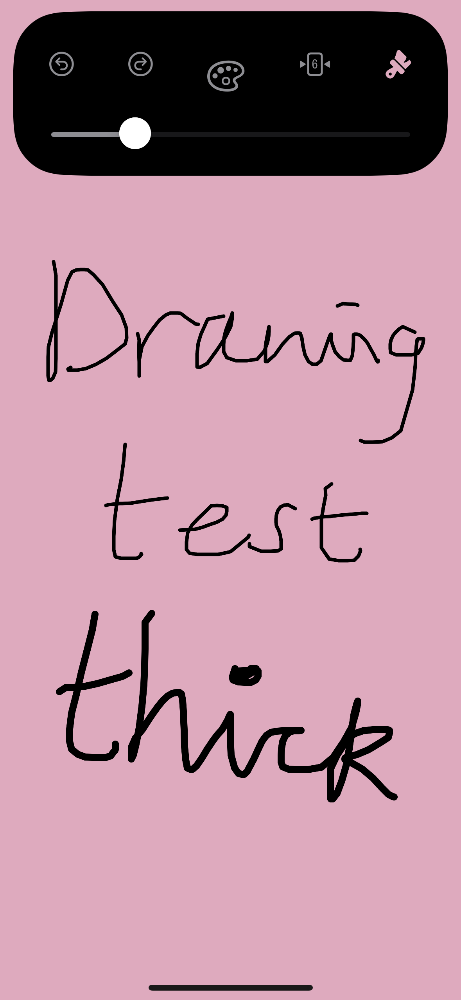
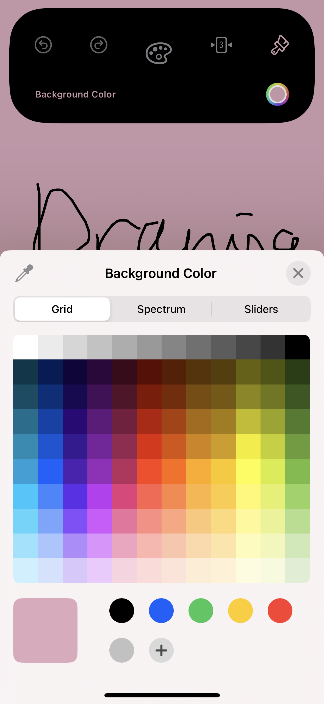

<h1>Draw</h1>

<h3>A minimal drawing app used to create random sketches.</h3>

Features:
  - customisable pen color from a list of preset colors
  - customisable pen width
  - customisable background color
  - Native Undo/Redo buttons
  - Undo/Redo tap gestures
  - 10 Taps to clear anr reset interface
  - A settings view which contains all of the buttons
    - can be toggled via a long press gesture
    - or by swiping up to disappear
   
Screenshots:
   
 
